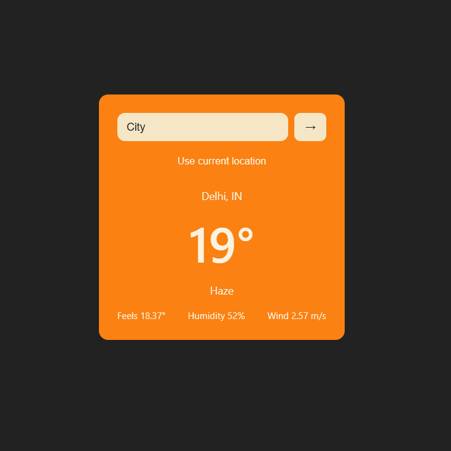
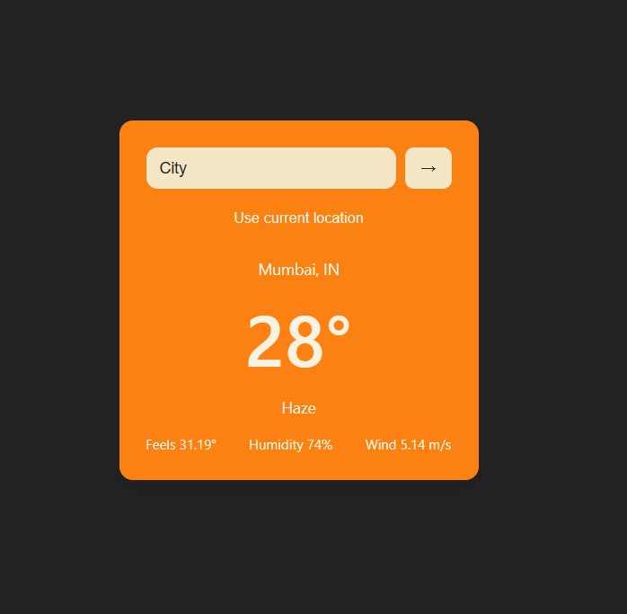

# 🌦️ React Weather App

A minimal and responsive weather application built using **React** and the **OpenWeather API**.  
The app allows users to search for any city or use their current location to view real-time weather information with a clean and modern UI.

🔗 **Live Demo:**  
https://react-weather-app-project.vercel.app/

---

## ✨ Features

- 🔍 Search weather by city name  
- 📍 Get current location weather using Geolocation API  
- 🌡️ Real-time temperature, humidity, wind speed, and weather condition  
- 💾 Saves last searched city using localStorage  
- 🎨 Minimal and responsive UI  
- 🚀 Deployed on Vercel  

---

## 🖼️ Screenshots

### Home / Weather View


### Search by City



---

## 🛠️ Built With

- React.js  
- JavaScript (ES6+)  
- HTML5 & CSS3  
- OpenWeather REST API  
- Vite  
- Vercel  

---

## 🚀 Getting Started

Follow these steps to run the project locally:

```bash
npm install
npm run dev
```

The application will run at:

```arduino
http://localhost:5173
```

